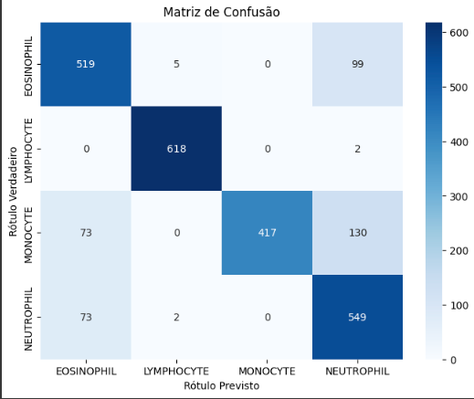

# 🧬 Classificador de Células Sanguíneas

Este projeto utiliza redes neurais convolucionais (CNNs) com TensorFlow e Keras para classificar imagens de leucócitos em quatro categorias diferentes.

## 📂 Descrição

- 🔬 Classificação automática de células sanguíneas em imagens de microscópio
- 📁 Dataset: [Blood Cell Dataset (Kaggle)](https://www.kaggle.com/datasets/paultimothymooney/blood-cells)
- 🧠 Modelo: MobileNetV2 pré-treinado com ajuste fino (Fine-Tuning)
- 🎯 Função de perda: Focal Loss (ideal para lidar com desbalanceamento de classes)
- ⚙️ Treinamento com callbacks:
  - EarlyStopping
  - ReduceLROnPlateau
  - ModelCheckpoint

## 🧪 Resultados

- **Acurácia de validação:** aproximadamente **84,55%**
- **Total de amostras no teste:** 2.487  
- **Total de acertos:** 2.103  
- **Matriz de confusão:**



### 📊 Acurácia por Classe

| Classe        | Acertos (preditos corretamente) | Total de amostras reais | Cálculo da acurácia      | Acurácia (%) |
|---------------|-------------------------------|--------------------------|---------------------------|--------------|
| Eosinófilos   | 519                           | 623                      | 519 ÷ 623 = 0,8326        | **83,26%**   |
| Linfócitos    | 618                           | 620                      | 618 ÷ 620 = 0,9968        | **99,68%**   |
| Monócitos     | 417                           | 620                      | 417 ÷ 620 = 0,6726        | **67,26%**   |
| Neutrófilos   | 549                           | 624                      | 549 ÷ 624 = 0,8798        | **87,98%**   |

## 🚀 Como Rodar

### 🔧 Pré-requisitos

- Python 3.8+
- TensorFlow 2.x
- NumPy, Matplotlib, scikit-learn, etc.

## 📦 Modelo Treinado

O modelo treinado já está disponível neste repositório:

➡️ [`modelo_final.keras`](./melhor_modelo.keras)

Ele foi salvo após atingir a melhor acurácia de validação, utilizando MobileNetV2 com ajuste fino e Focal Loss.

### ▶️ Executando


```bash
# Clonar o repositório
git clone https://github.com/seu-usuario/classificador-celulas-sanguineas.git
